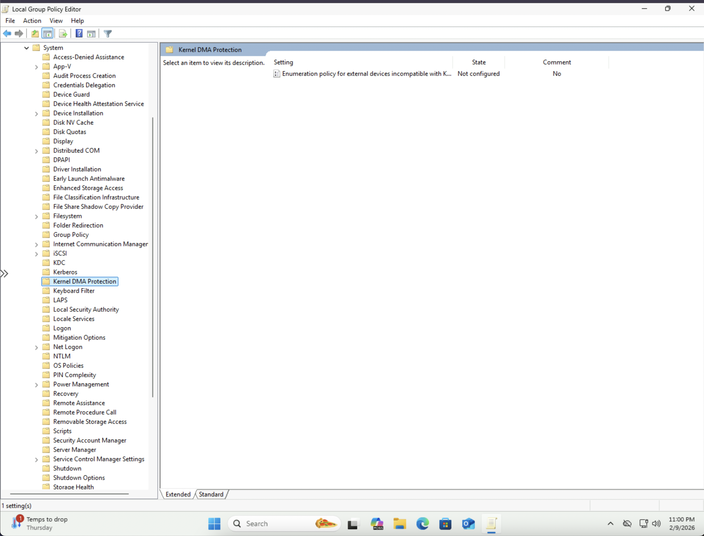
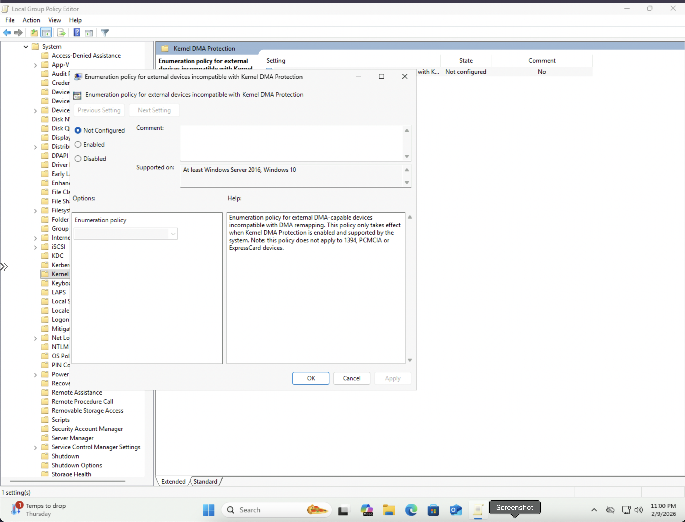
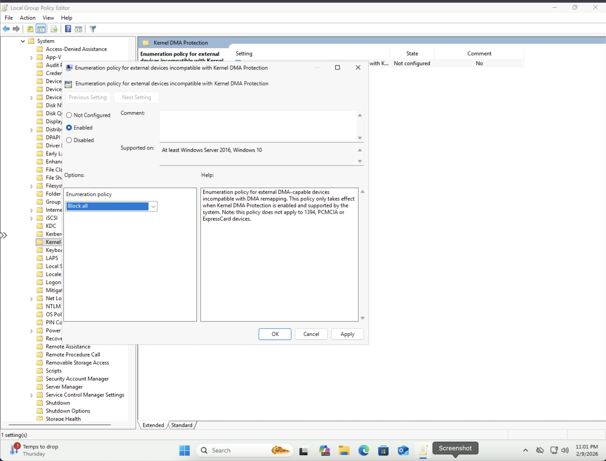
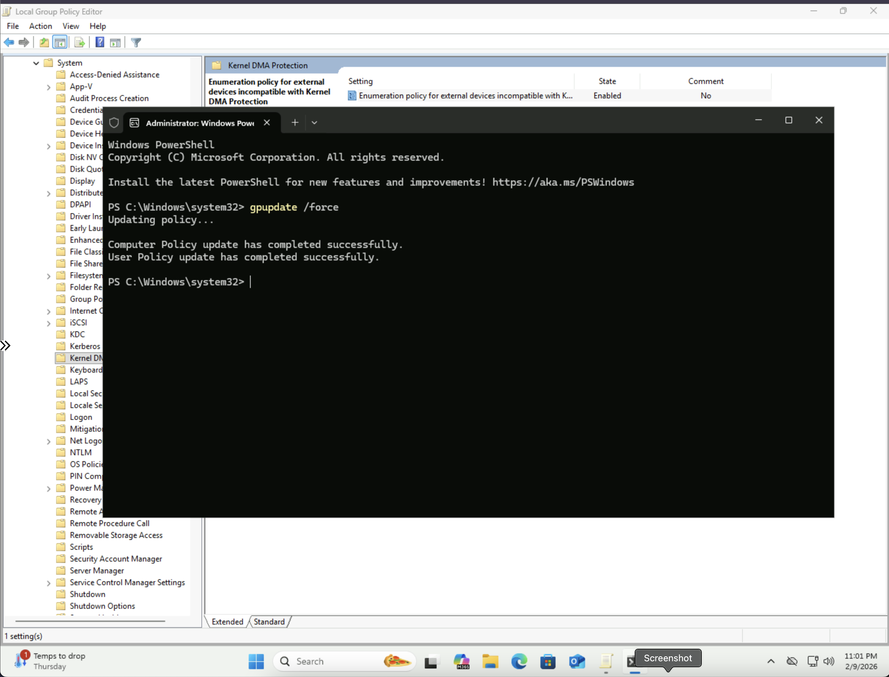
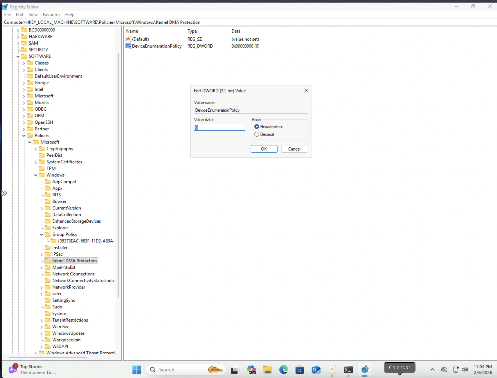
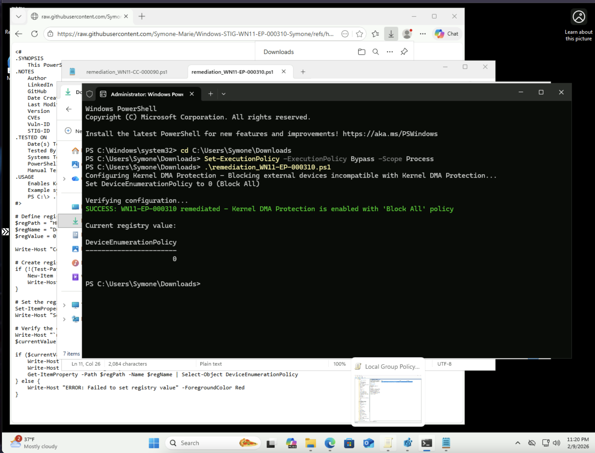

# Windows STIG WN11-EP-000310 Remediation

## Overview
This repository contains remediation for STIG vulnerability WN11-EP-000310: "Windows 11 Kernel (Direct Memory Access) DMA Protection must be enabled."

## Vulnerability Details
- **STIG-ID**: WN11-EP-000310
- **Vuln-ID**: V-253426
- **Severity**: CAT II
- **Description**: Kernel DMA Protection protects against drive-by Direct Memory Access (DMA) attacks using PCI hot plug devices. External peripherals with DMA capabilities could be used to read system memory or inject malicious code. This setting blocks external devices incompatible with DMA remapping.

## Remediation Methods

### Automated (PowerShell Script)
Run the `remediation_WN11-EP-000310.ps1` script as Administrator to automatically enable Kernel DMA Protection.

**To run:**
```powershell
PS C:\> .\remediation_WN11-EP-000310.ps1
```

### Manual (Group Policy Editor)
1. Open Local Group Policy Editor (`gpedit.msc`)
2. Navigate to: `Computer Configuration` → `Administrative Templates` → `System` → `Kernel DMA Protection`
3. Double-click **"Enumeration policy for external devices incompatible with Kernel DMA Protection"**
4. Select **"Enabled"**
5. In the dropdown under "Options:", select **"Block All"**
6. Click **Apply**, then **OK**
7. Open Command Prompt as Administrator and run: `gpupdate /force`
8. Verify in Registry Editor at: `HKEY_LOCAL_MACHINE\SOFTWARE\Policies\Microsoft\Windows\Kernel DMA Protection`
   - Confirm `DeviceEnumerationPolicy` = `0`

## Screenshots

### Kernel DMA Protection Navigation


### Policy Configuration (Before)


### Policy Configuration (Enabled with Block All)


### Manual Verification - Group Policy Update


### Manual Verification - Registry Editor


### PowerShell Automated Remediation Success


## Testing Information
- **Tested By**: Symone-Marie Priester
- **Date Tested**: February 9, 2025
- **System**: Windows 11 Pro (Version 10.0.26200.7623)
- **PowerShell Version**: 5.1
- **Methods**: Both automated (PowerShell) and manual (Group Policy Editor)

## Repository Structure
```
├── remediation_WN11-EP-000310.ps1                    # PowerShell remediation script
├── Kernel_DMA_Protection_Navigation.png              # Navigation screenshot
├── Enumeration_Policy_Before_Configuration.png       # Before configuration
├── Enumeration_Policy_Enabled_Block_All.png          # Enabled with Block All
├── GPUpdate_Force_Success.png                        # Manual verification
├── Registry_Verification_DeviceEnumerationPolicy.png # Registry verification
├── WN11-EP-000310_PowerShell_Success.png            # PowerShell success
└── README.md                                         # This file
```

## Author
**Symone-Marie Priester**
- LinkedIn: [linkedin.com/in/symone-mariepriester](https://linkedin.com/in/symone-mariepriester)
- GitHub: [github.com/Symone-Marie](https://github.com/Symone-Marie)
